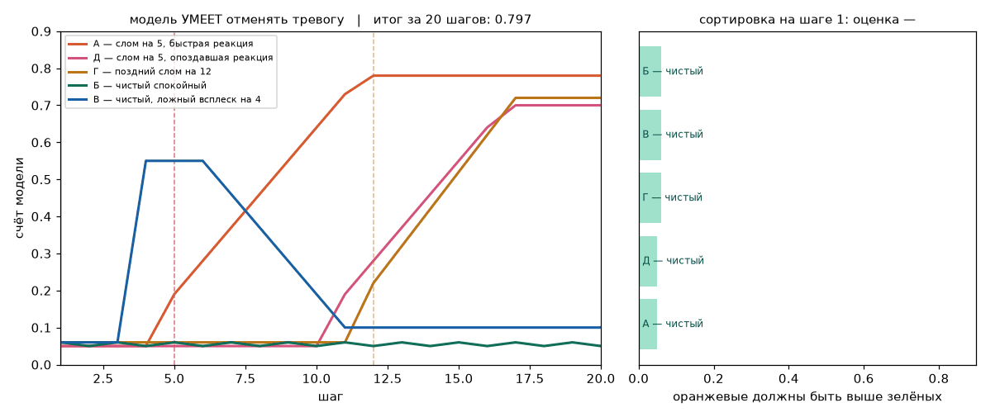
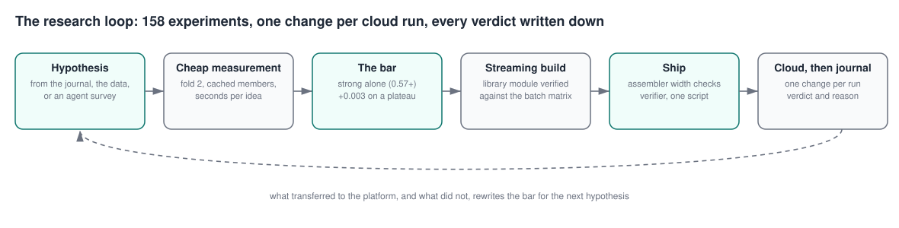

# adia-structural-break

**Real-time structural-break detection — top 10% of 1,716 teams in the [ADIA Lab Structural Break Challenge: Real-Time Edition](https://hub.crunchdao.com/competitions/structural-break-real-time) (CrunchDAO, May–October 2026), and the research process that got it there: 158 logged experiments run by an engineer directing an LLM assistant as a research team.**

## Result in one screen

| | |
|---|---|
| **Final score** | **0.6299 TS-AUC** on the platform's hidden test set, about **rank 160 of 1,716** (leader 0.680). Final out-of-sample evaluation by the organisers: end of October 2026. |
| **Path** | 0.5877 at the first network blend → 0.6299 at the close; **+0.024 of it in the last five days**, from one idea found by research rather than iteration |
| **The idea** | whiten every series by its own history — an AR(p) fit, a conditional scale, the innovation ECDF — and read every test (CUSUM, GLR, Shiryaev-Roberts odds) on the whitened stream, where a break of any kind is a departure from i.i.d. N(0,1) |
| **The process** | a local evaluator identical to the platform's metric, cached member predictions (an idea is read in seconds), a shipping bar learned from what transferred to the platform, streaming implementations verified against the batch matrices before every push, and a journal with a verdict and a reason for every experiment — failures recorded with the same care as gains |
| **Record** | 158 experiments, 45 submissions, 8 platform moves, 2 research surveys by LLM agents, 3 silent bugs caught by verification before they reached the platform |

Start with [docs/method.md](docs/method.md) (how the search was run), then
[docs/experiments.md](docs/experiments.md) (the journal), the two surveys in
[docs/research/](docs/research/), and [docs/submissions.md](docs/submissions.md)
(every submission, its fold and cloud numbers).

## What this demonstrates

The owner's part was the one a research lead plays: setting the target and the
budget, choosing the direction when the numbers tied, running the platform's
cloud evaluations and deciding what to ship, and — the decisive move — turning
the assistant from an experiment runner into a research team when the local
loop had plateaued: two parallel surveys (what the leaders build; how the
data generator makes its breaks) produced the whitened-stream member and
+0.013 in the cloud in two days, after two weeks of +0.002 steps.

| Skill | Where it shows |
|---|---|
| **Sequential detection theory** | CUSUM, Page–Hinkley, GLR over dyadic windows, Bayesian online change-point (BOCPD) run-length posteriors, Shiryaev–Roberts odds integrated over the change time, whitening by AR(p) + conditional scale + probability integral transform — `src/structural_break/` |
| **Learning to rank under a cross-sectional metric** | per-step lambdarank rankers and classifiers, boundary augmentation that moves breaks to where the metric weighs them, dilated causal networks over channel trajectories trained with a per-step ranking loss |
| **Streaming engineering** | every channel family has a vectorised batch builder for training and a streaming class for inference, verified equal to 1e-6; sub-10 ms per step for 500+ channels and 30 models |
| **Evaluation discipline** | an untouched fold as the only ruler; a metric implementation line-for-line equal to the platform scorer; the fold-to-cloud transfer measured on every submission and turned into a shipping bar |
| **Research management with LLM agents** | parallel surveys, a data-forensics agent, adversarial verification of claimed gains, a documentation agent — each with a written brief, hard resource limits and a report; the protocol is in [CLAUDE.md](CLAUDE.md) |
| **Honest record-keeping** | 158 experiments with verdicts; the dead ends ([docs/method.md § What did not work](docs/method.md)) take as much space as the wins |

## How the solution works

Every online point updates 206 streaming channels (classical detectors on
three views of the series, multi-scale statistics, retrospective scans, a
forecaster's error, spectral bands, a BOCPD run-length posterior) and a
second stream: the series whitened by its own history, on which 90
statistics, 21 Shiryaev–Roberts odds and 8 constants of the history's own
family are read. Trees read each step as a snapshot; dilated causal
networks read how the channels move. Members built on their own inputs —
the mass battery, the frequency/dependence and novelty views, the whitened
member — are blended by hand on an untouched fold, and the whitened member
carries the largest share.

*The whitened monitor on a synthetic series: an AR(0.5) history, a 45%
increase of the innovation scale at step 260. The Shiryaev–Roberts
log-odds for a variance increase (the accumulated posterior odds of a
change at some earlier step) and the scale CUSUM both turn within a few
dozen points.*

*The metric: at every online step an AUC across all series alive at that
step, so only the ordering between series matters, and early steps count.*

## The task

A univariate series arrives in two parts. The **historical segment** — 1,000 to
5,000 observations, guaranteed free of breaks — is given in full at the start.
The **online segment** — 10 to 1,000 observations — is then revealed **one
observation at a time**, and after each one the model must output a score in
[0, 1]: the confidence that a permanent structural break has *already* occurred.
Half the series contain a break at an unknown position; half contain none.

Scored by **Time-Stratified AUC**: at each online step an ordinary AUC across
every series alive at that step, averaged with weights equal to the number of
positive-negative pairs available there.

Two properties of that metric shape every design decision here:

- Only the **ordering between series** at a given step matters, never the
  absolute level of any score. A uniformly pessimistic detector loses nothing;
  a detector that ties scores together loses everything, because ties are what
  an AUC is made of.
- **Early steps weigh as much as late ones**, and early steps are where almost
  no evidence exists. A detector that is only right after two hundred
  observations scores poorly however certain it eventually becomes.

## Where it stands

The platform moved eight times in five weeks, best first:

| Cloud | Submission | What moved it |
|---|---|---|
| **0.6299** | **#45** | a pool of three trajectory networks reading the core's channels and the whitened ones together — +0.0013 on the fold, +0.0022 in the cloud; **the final selection** |
| 0.6277 | #44 | the whitened member rebuilt: history context, a bag of two per-step rankers, three trajectory networks over the whitened channels — +0.0070 on the fold, +0.0091 in the cloud |
| 0.6186 | #41 | the whitened stream as a member: AR(p) by BIC, a conditional scale and the innovation ECDF fitted on the history, ninety statistics on the normal scores — +0.0118 on the fold, +0.0130 in the cloud |
| 0.6056 | #39 | a frequency member and a gated frequency+novelty union — +0.0046 on the fold, +0.0008 in the cloud |
| 0.6048 | #37 | the mass member with the network pool doubled — +0.0002, the pool priced at nothing |
| 0.6046 | #36 | a mass battery of plain statistics trained as its own member |
| 0.6007 | #30 | a run-length posterior for the classifier, twelve networks |
| 0.6004 | #28 | boundary augmentation, tripled: pseudo-series with early breaks |
| 0.5893 | #23 | a new channel family — fourteen spectral bands |
| 0.5877 | #18 | the channel–trajectory networks joined the trees |

Two rules came out of those moves and now govern the project. A member
ships only when it is **strong on its own** (0.57 or better on the fold)
and clears **+0.003 on a plateau** of shares — weak members transferred to
the platform at a sixth of their fold gain, strong ones one-for-one. And a
member is worth adding only when it reads a **different input**: a new
model on the same channels correlates at 0.9 with what is already there and
adds nothing, however strong it is alone (the single strongest model of the
project, a ranker over all 317 channels at 0.6304, added +0.0003 to the blend).

The ceiling is the task's, not the recipe's: the data forensics found that
about 30% of breaks change nothing any of 49 statistics can measure, and
that only two kinds of change carry signal — an increase of the innovation
variance and a shift of the AR coefficients. The full list of what was tried,
in order, with verdicts: [docs/experiment_table.md](docs/experiment_table.md).

## Layout

    src/structural_break/    the library: normalisation, streaming detectors,
                             multi-scale channels, retrospective scans, the CNN,
                             combiners, evaluation
    submissions/             one directory per submission, exactly as sent —
                             each main.py assembled from the library by
                             scripts/assemble_submission.py, never edited by hand
    notebooks/               model inspection on the labelled hundred, generated
                             and executed by scripts/build_analysis_notebook.py
    docs/                    the experiment log: hypothesis, design, result and
                             kill condition per submission, failures included

Competition data is never committed — it is 200 MB of parquet fetched by
`crunch setup`, and the workspace that command creates is gitignored.

## Reproducing

    pip install crunch-cli
    crunch setup structural-break-real-time <name> --token <token>
    cp submissions/001-classical-detectors/main.py <workspace>/
    cd <workspace> && crunch test

### Shipping a submission

    scripts/ship_submission.sh 078-two-classifiers interface_078.py meta_078.txt ../resources078 "message"

Assembles from the library, refuses a channel-width mismatch, verifies the
assembled monitor against the training matrices with the verifier that
lives next to the interface, profiles milliseconds per step, and only then
pushes. Nothing reaches the platform unverified.

### Tests

    PYTHONPATH=src python -m unittest discover -s tests -v

Standard library only. The tests guard the two places where a submission
can silently disagree with its training: the streaming change-point monitor
is checked against the batch filter that built the training channels, and
the assembler's channel check is exercised on fake artifacts — including
the exact mismatch that killed submission #25.

## Relationship to the organisers' quickstarter

The EWMA baseline published by CrunchDAO is used as a reference point and is
reimplemented in `src/structural_break/evaluate.py` so that both can be scored
on the same rows. No other code is taken from it.
