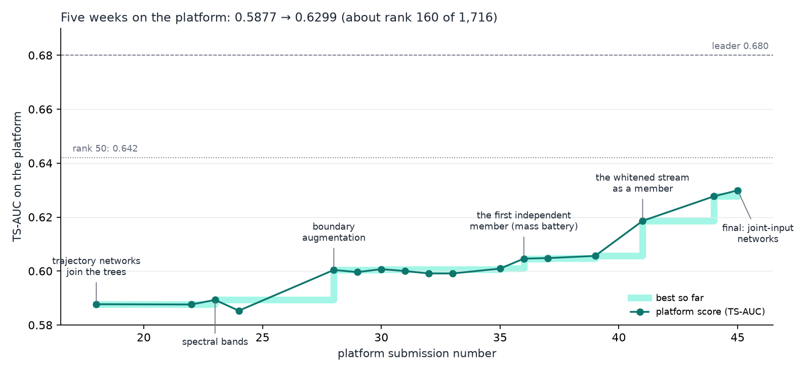
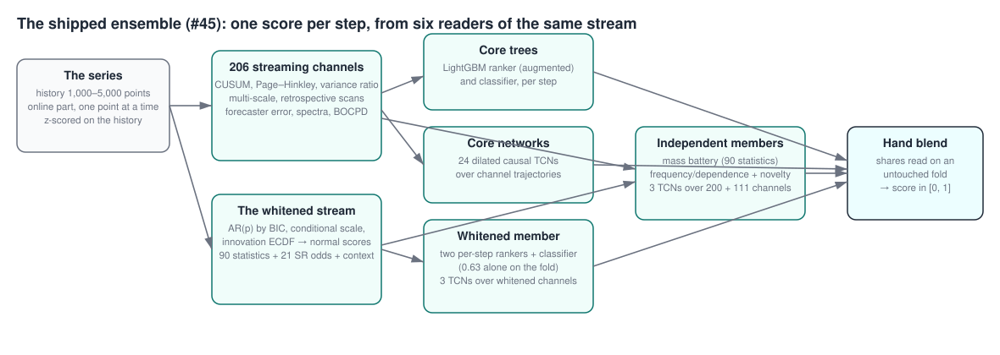
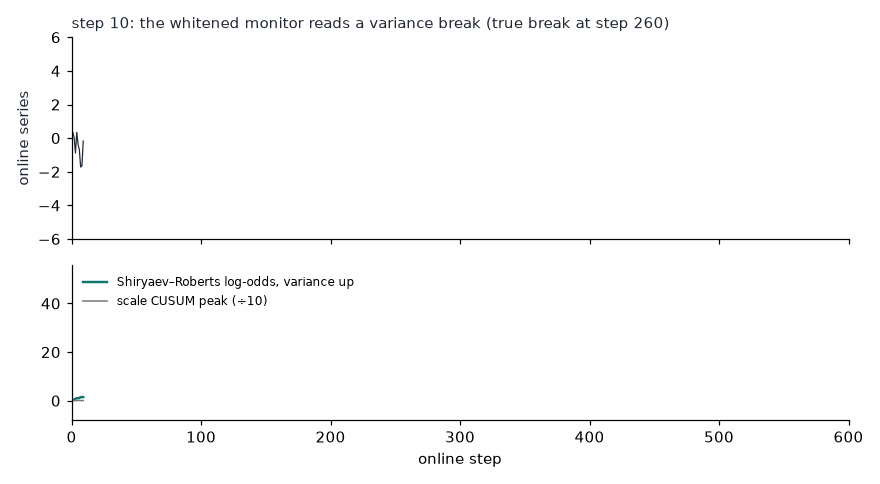

# adia-structural-break

**Real-time structural-break detection in time series — my entry to the [ADIA Lab Structural Break Challenge, Real-Time Edition](https://hub.crunchdao.com/competitions/structural-break-real-time) (CrunchDAO).** Closed the submission phase at **0.6299 TS-AUC — about rank 160 of 1,716 registered participants on the public leaderboard (781 live models; leader 0.680)**; the organisers' out-of-sample ranking is due at the end of October 2026. The repository holds the solution and the complete research record: 158 logged experiments, run by me directing an LLM coding assistant as the research team.

*Solo entry · August–October 2026 · Python, NumPy, SciPy, LightGBM, PyTorch · sequential change-point detection, learning to rank, streaming inference, LLM-agent research workflows · MIT licence*

## TL;DR

- **Result.** 0.5877 at the first network blend → 0.6299 at the close of submissions on 1 October 2026 — top 10% of registrants, about top 20% of live models. The organisers' final out-of-sample ranking is due at the end of October.
- **The detector.** An ensemble of per-step LightGBM rankers and classifiers over hand-built streaming statistics, dilated causal networks over their trajectories, and independent members on their own inputs. The decisive member whitens each series by its own history — an AR(p) fit, a conditional scale, the innovation ECDF — and reads CUSUM, GLR and Shiryaev–Roberts statistics on the whitened stream, where a break of any kind is a departure from i.i.d. N(0,1). It was worth +0.024 on the platform in the last five days.
- **The record.** Every experiment has a hypothesis, a reading, a verdict and a reason; the dead ends take as much space as the gains — including three silent bugs found along the way (one of them, a width mismatch, reached the platform as #25 and taught the assembler its width check). Start with [docs/method.md](docs/method.md) (how the search was run), then [docs/experiments.md](docs/experiments.md) (the journal), [docs/research/](docs/research/) (the two surveys that produced the turn) and [docs/submissions.md](docs/submissions.md) (every submission with its fold and cloud numbers).

## What I did, and what the assistant did

I ran this project as its research lead, with an LLM coding assistant as the
team. My part: the targets (fold-2 0.617 before any submission, then 0.65),
the budget (15 cloud hours a week, one change per run), the evaluation
protocol (one untouched fold as the only ruler; a shipping bar — strong alone
at 0.57+, +0.003 on a plateau — learned from how fold gains transferred to
the platform), the direction when readings tied, every cloud evaluation and
every shipping decision, and the decision to redirect the assistant from
running experiments to running two parallel research surveys when the local
loop had plateaued — which produced the whitened-stream member and +0.013 in
the cloud within two days, after two weeks of +0.002 steps. The assistant
built the library, the members, the assembler and the verifiers, ran the 158
logged experiments, and wrote the journal and the surveys. The journal
references for each decision are in [docs/method.md § 4](docs/method.md);
the working protocol the assistant follows is [CLAUDE.md](CLAUDE.md); the
briefs the agents received, as given, are in [docs/briefs/](docs/briefs/).

| Skill | Where it shows |
|---|---|
| **Sequential detection theory** | CUSUM, Page–Hinkley, GLR over dyadic windows, Bayesian online change-point detection (BOCPD) run-length posteriors, Shiryaev–Roberts odds integrated over the change time, whitening by AR(p) + conditional scale + probability integral transform — `src/structural_break/` |
| **Learning to rank under a cross-sectional metric** | per-step lambdarank rankers and gradient-boosted classifiers (LightGBM), boundary augmentation that moves breaks to where the metric weighs them, temporal convolutional networks (PyTorch) over channel trajectories trained with a per-step ranking loss |
| **Streaming engineering** | every channel family has a vectorised batch builder for training and a streaming class for inference; the two are compared on training series before every push (measured agreement 1e-6 to 3e-6; the shipping gate is 1e-4, 1e-2 for the whitened block); 535 channels and about 30 models at 8 ms per step (gate 12 ms) |
| **Model validation** | one fixed fold as the ruler, with the selection it absorbed (blend shares, gates, a few recipe choices) measured and written down; the metric implemented as the platform scores it — a per-step AUC weighted by positive–negative pairs, tested against scikit-learn's `roc_auc_score`; a data-leakage incident caught and documented in week one; the fold-to-cloud transfer measured on every submission and turned into a shipping bar |
| **Research management with LLM agents** | parallel literature and leaderboard surveys, a data-forensics agent, adversarial verification of claimed gains, documentation agents — each with a written brief, hard resource limits and a report |
| **Negative results logged** | 158 experiments with verdicts; the dead ends in [docs/method.md § 6](docs/method.md) take as much space as the wins |

## How the solution works

Every online point updates 206 streaming channels — classical detectors on
three views of the series, multi-scale statistics, retrospective scans, a
forecaster's error, spectral bands, a BOCPD run-length posterior (the
networks read the first 200, the classifier all 206) — and a second stream:
the series whitened by its own history, on which 90 statistics, 21
Shiryaev–Roberts odds and 8 constants of the history's own family are read.
Trees read each step as a snapshot; the networks read how the channels move.
Members built on their own inputs are blended by hand on an untouched fold,
and the whitened member carries the largest share.

*The whitened monitor on a synthetic series — an AR(0.5) history and a 45%
increase of the innovation scale at step 260. The Shiryaev–Roberts log-odds
for a variance increase and the scale CUSUM both turn within a few dozen
points.*

## The task

A univariate time series arrives in two parts: a break-free **history** of
1,000–5,000 points, given at once, and an **online segment** of 10–1,000
points revealed one observation at a time. After every observation the model
outputs a score in [0, 1]: the confidence that a permanent structural break
has *already* occurred. Half the series break at an unknown position, half
never do. The metric is a **Time-Stratified AUC**: at every online step an
AUC across all series alive at that step, weighted by the positive–negative
pairs available there. Two consequences shaped every design decision: only
the *ordering between series* at a step matters, never the level of a score;
and the weight sits where both classes are populated — 12% of it below step
100 and 83% on steps 100–700 — so a detector is judged mostly on the first
few hundred points after a break, where the evidence is still thin.

## Where it stands

The best platform score moved ten times in five weeks, best first:

| Cloud | Submission | What moved it |
|---|---|---|
| **0.6299** | **#45** | three trajectory networks reading the core's channels and the whitened ones together — **the final selection** |
| 0.6277 | #44 | the whitened member rebuilt: history context, a bag of two per-step rankers, three networks over the whitened channels |
| 0.6186 | #41 | the whitened stream as a member — +0.0118 on the fold, +0.0130 in the cloud |
| 0.6056 | #39 | a frequency member and a gated frequency+novelty union — +0.0046 on the fold, only +0.0008 in the cloud |
| 0.6048 | #37 | the network pool doubled — +0.0002, the pool priced at nothing |
| 0.6046 | #36 | a mass battery of plain statistics trained as its own member |
| 0.6007 | #30 | a run-length posterior for the classifier, twelve networks |
| 0.6004 | #28 | boundary augmentation, tripled: pseudo-series with early breaks |
| 0.5893 | #23 | a new channel family — fourteen spectral bands |
| 0.5877 | #18 | the channel-trajectory networks joined the trees |

Two rules came out of those moves. A member ships only when it is **strong
on its own** (0.57 or better on the fold) and clears **+0.003 on a plateau**
of shares: weak members transferred to the platform at a sixth of their fold
gain, strong ones one-for-one. And a member is worth adding only when it
reads a **different input**: a new model on the same channels correlates at
0.9 with what is already there and adds nothing however strong it is alone —
the strongest single model of the project, a ranker over all 317 channels at
0.6304, added +0.0003 to the blend. Part of the ceiling is the task's — the
data forensics found that about 30% of breaks change nothing any of 49
statistics can measure — and the rest is recipe: the leader reads 0.680.
The full list of what was tried, in order, with verdicts:
[docs/experiment_table.md](docs/experiment_table.md).

## Limitations

- The fold-to-cloud offset is a stable −0.016 to −0.020 across a dozen readings although the shipped models train on 25% more data than the fold models; the journal measures it and uses it, but does not explain it. The public test set mixes synthetic and real-world series; the training set may not in the same proportion.
- Fold 2 chose more than blend shares over five weeks (a BOCPD hazard, the slow-learner recipe, a gate, share plateaus); the journal records the optimism this adds, and the two reserve folds were never spent on a confirmation.
- The whitening recipe — AR(p) by BIC, a conditional scale, the innovation ECDF — follows a competitor's public description found in the survey of 27 September; the battery, the odds, the member's learners and the verification are this project's.
- The rank is a public-leaderboard reading at the close; the organisers' out-of-sample evaluation decides the final one.

## Next

Networks over the whitened innovation stream itself (158, +0.0005 so far), a fold-3 confirmation of the final blend, the synthetic generator of the forensics as a training source, and the open question of the offset above.

## Try it in two minutes (no competition data needed)

To rebuild the full workspace from the competition data and reproduce a fold-2 number (0.6452 for the final blend), follow [docs/reproduce.md](docs/reproduce.md): pinned versions, the build order of every matrix, and the one command sequence that ends in the score.

    git clone https://github.com/bamasa/adia-structural-break && cd adia-structural-break
    pip install -r requirements.txt
    PYTHONPATH=src python -m unittest discover -s tests -v     # 23 tests, under 5 s
    PYTHONPATH=src python scripts/make_figures.py              # the figures above, from synthetic series

    pip install .          # or: pip install git+https://github.com/bamasa/adia-structural-break
    python -c "import numpy as np; from structural_break import WhiteMonitor, channel_names; \
      m = WhiteMonitor(np.random.default_rng(0).standard_normal(2000), odds=True); print(len(m.update(0.3)), 'channels')"

## Layout

    src/structural_break/    the library: normalisation, streaming detectors,
                             multi-scale channels, retrospective scans, the CNN,
                             combiners, evaluation
    submissions/             one directory per submission, exactly as sent —
                             each main.py assembled from the library by
                             scripts/assemble_submission.py, never edited by hand
    notebooks/               model inspection on the labelled hundred, generated
                             and executed by scripts/build_analysis_notebook.py
    docs/                    the experiment log: hypothesis, design, result and
                             kill condition per submission, failures included

Competition data is never committed — it is 200 MB of parquet fetched by
`crunch setup`, and the workspace that command creates is gitignored.

## Reproducing

    pip install crunch-cli
    crunch setup structural-break-real-time <name> --token <token>
    cp submissions/001-classical-detectors/main.py <workspace>/
    cd <workspace> && crunch test

### Shipping a submission

    scripts/ship_submission.sh 078-two-classifiers interface_078.py meta_078.txt ../resources078 "message"

Assembles from the library, refuses a channel-width mismatch, verifies the
assembled monitor against the training matrices with the verifier that
lives next to the interface, profiles milliseconds per step, and only then
pushes. Nothing reaches the platform unverified.

### Tests

    PYTHONPATH=src python -m unittest discover -s tests -v

Standard library only. The tests guard the two places where a submission
can silently disagree with its training: the streaming change-point monitor
is checked against the batch filter that built the training channels, and
the assembler's channel check is exercised on fake artifacts — including
the exact mismatch that killed submission #25.

## Relationship to the organisers' quickstarter

The EWMA baseline published by CrunchDAO is used as a reference point and is
reimplemented in `src/structural_break/evaluate.py` so that both can be scored
on the same rows. No other code is taken from it.

## Contact

GitHub: [bamasa](https://github.com/bamasa). Licence: MIT.
